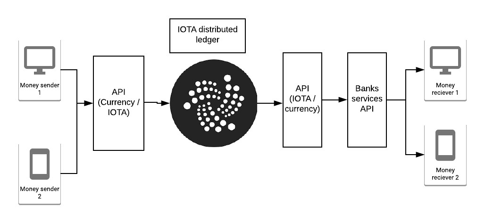

# EasyGiro

Distributed ledger for money transfer between clients. 

Money transacions can be represented as data transfer into the tangle,
the real world use of the data depends on the interaction api. 

## IOTA ledger

* IOTA ledger makes possible to do real time transactions, 
in our case money transfers!. (these transactions are "feeless" and can be "microtransactions") 
* IOTA ledger use and specifics are docummented in [iotacore](/iotacore/README.md)

## Interaction API

The interaction api is in charge of making calculations to change hard currency to 
iota and viceverza, also it makes posible communication with banks services.  

* The interaction api specifics are documented on [apicore](https://github.com/jcortes/easygiro-server)

### Infrastructure considerations 

* Microservice oriented arquitecture on k8s (GCP or AWS or others).
* The microservices can convert IOTA /to hardcurrency or hardcurrency to IOTA 
and connect to banks APIs

## Clients
* Clients can be any IOT devices (smartphones, smartwatch, latops..)  

