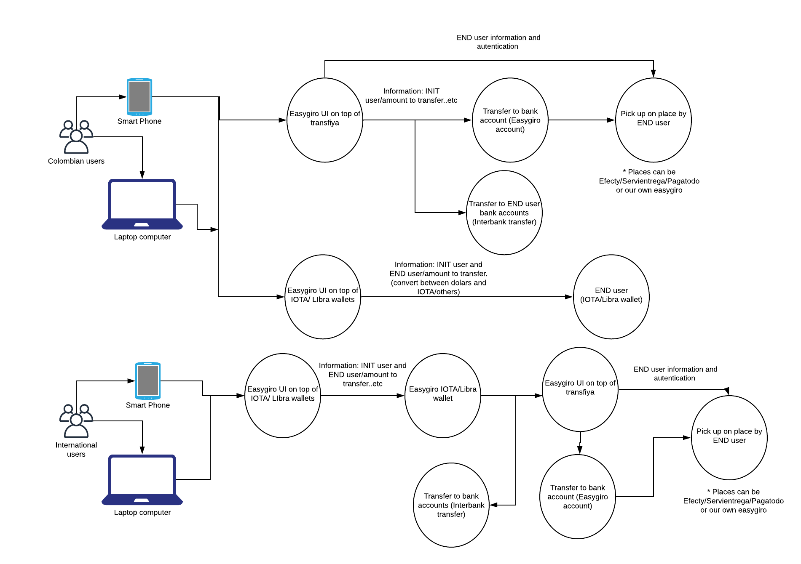

# Introduction. 

* For starters MoneyOnTangle can be coupled to work without any specifical backend 
  if you have a cripto wallet. 


## Proposed finantial Workflow



* 1. Cellphone/Laptop. Easygiro UI (in top of Payzen/Powwi and/or IOTA)  
* 2. Easygiro/Powwi/Payzen should give us the amount to transfer. 
* 3. Transfer that amount to Our IOTA - blockchain wallet.
* 3. (A) Also another posibility could be transfering to a normal bank account and then this could be claim at a physical point. (Efecty / servientrega. Know the regulations. Show them the solution . with demo.) for this case we have to make 
a web service that tells us the amount of money transfered to the local bank account. 
* 4. Going back to Powwi/Payzen - Easygiro. if needed. if not transfer to blackchain wallet.

### Competitors / allies
* International transfer services: western union 
* Powwi (Payments) 
* Nequi
* Efecty / Servientrega.
* Probably a good application could be iota transfer between iota wallets and then make the intereaction with local banks via powwi- (im doing a quotation for powwi)
 

* Transaction cost Efecty
```
$5.000 - $50.000 	$ 4.000
$50.001 - $100.000 	$ 6.000
$100.001 - $150.000 	$ 7.500
$150.001 - $200.000 	$ 8.300
$200.001 - $500.000 	$3.000+3%
$500.001 - $1.000.000 	2,99%*
```
* Our main focus could be micro payments or micro transfers from foreing countries
* Also for people that dont have bank accounts.

## Advantages of a DLT. 

* Knowing the state of the transaction in any given time.
* Easy interactions with digital currencies.
* Not having to rely on a centralized solution (pse/payzen/credibanco...) 

#### References. 
* https://www.achcolombia.com.co/transfiya
* payzen (pasarela de pagos). 
